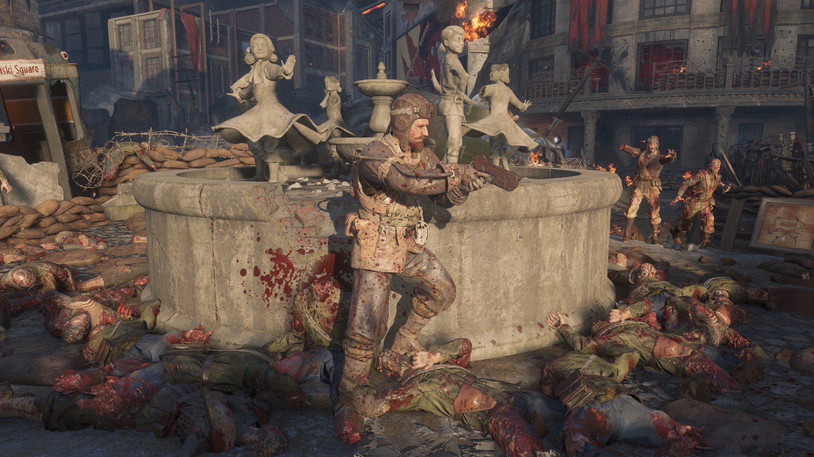
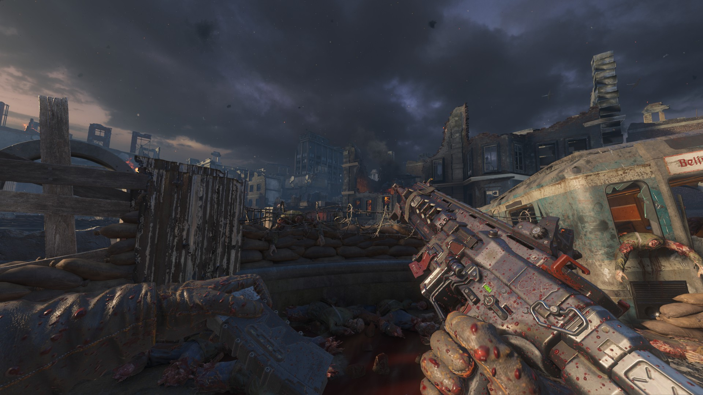

# 🩸 Call of Duty: Black Ops 3 Zombies Bloodsplatter 🩸

A script to apply bloodsplatter on the player when they are near AI that receives damage.

# Installing

This covers maps, for mods, the installation is similar, but instead of a main map script, you'll more than likely have a script you use for injection and/or your own scripts to add to.

1. To start go to the [Releases](https://github.com/Scobalula/Bo3Bloodsplatter/releases) and download the latest release. Do not clone the repo as I may push code that isn't tested, the Releases will contain the latest working version.

2. Once downloaded, copy the `share` and `texture_assets` to your Call of Duty: Black Ops III folder.

3. Add the following to your zone file: 
```
scriptparsetree,scripts\zm\_zm_bloodsplatter.gsc
scriptparsetree,scripts\zm\_zm_bloodsplatter.csc
material,mc/mtl_bloodsplatter_scripted
```
4. Next add the following to your GSC/CSC files (for maps this will be mapname.gsc/csc):

```cpp
#using scripts\zm\_zm_bloodsplatter;
```

5. Compile and test. 😘

# Reporting Problems

If you run into issues feel free to open an issue, I am also open to anyone to improve the script by making a pull request! When working on your map always have `developer 2` on, as it helps to identify where problems are and it can also assist me in identifying possible problems and where they are within the script.

❤️ You can also join my Discord to report issues or get general help ❤️

[](https://discord.gg/RyqyThu)

# Notes

The script may interfere with other scripted material types that utilize `scriptVector0` but I haven't ran into it, most emissive materials used by wonder weapons use `scriptVector2` and therefore this script doesn't interfere with them. If you run into it you'll need to add weapon checks, since I have no need for this the script doesn't account for this nor does it expose weapon checks.

Some vehicles/actors logically shouldn't splash blood, such as the Valkyrie Drones in Gorod Krovi, the script exposes 2 functions `register_bloodsplatter_immunity` and `deregister_bloodsplatter_immunity` to register certain AI as immune, refer to the script for more info.

# Credits

If you use the script there is no requirement to credit me, focus on making your projects extra spicy. 🌶️

# Screenshots





